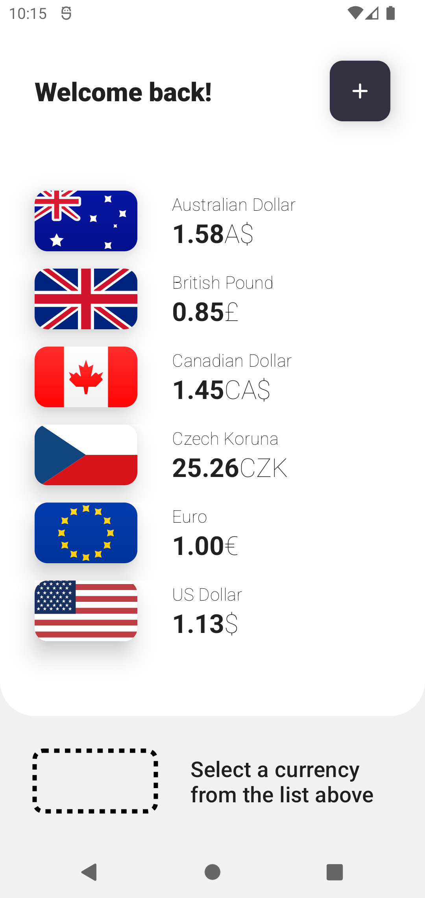
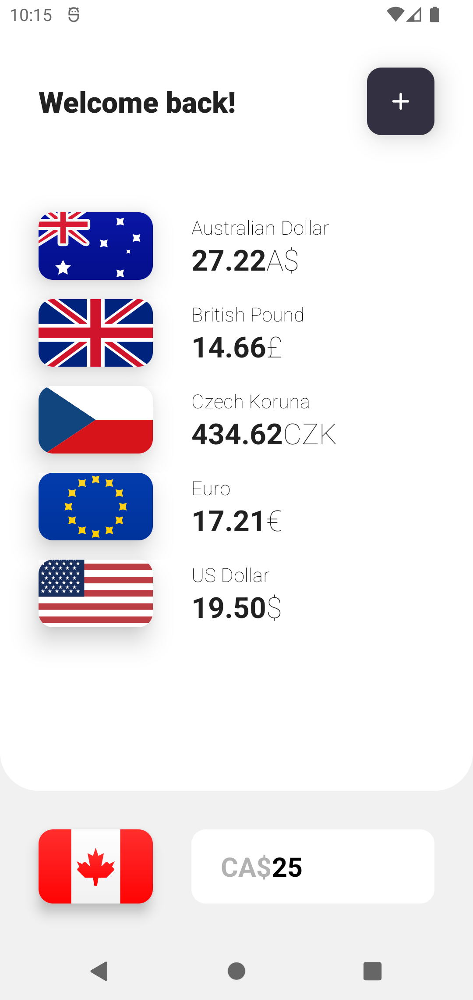
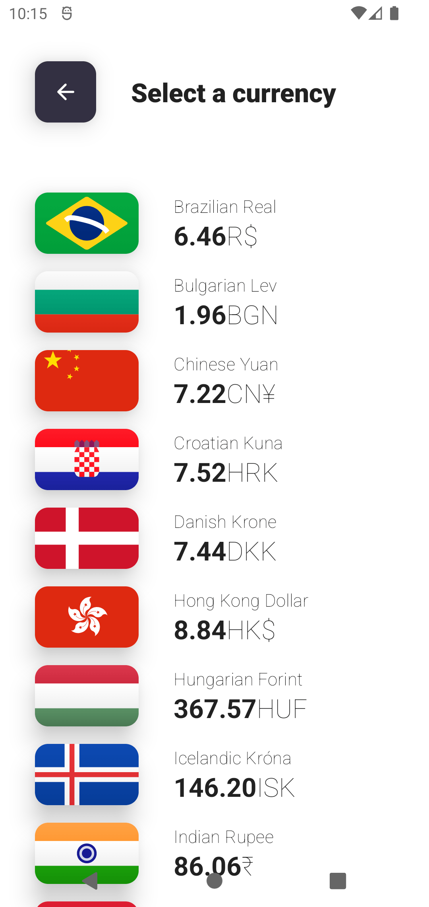
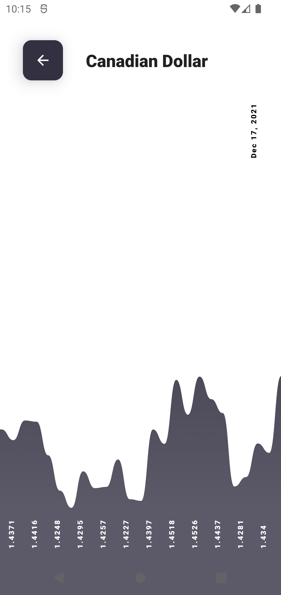
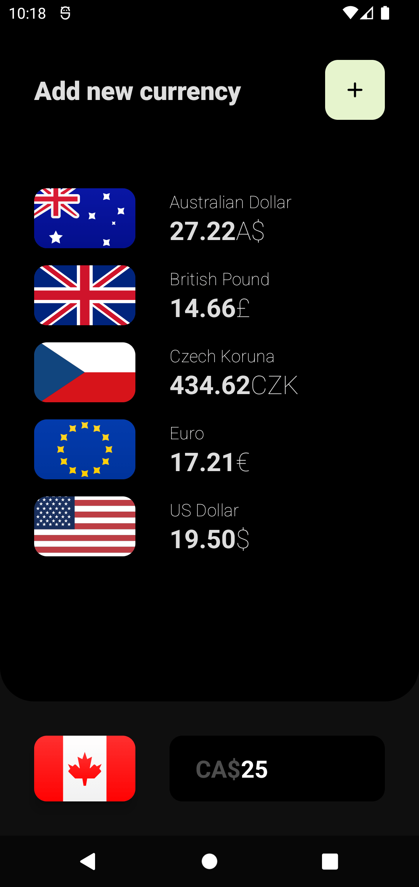
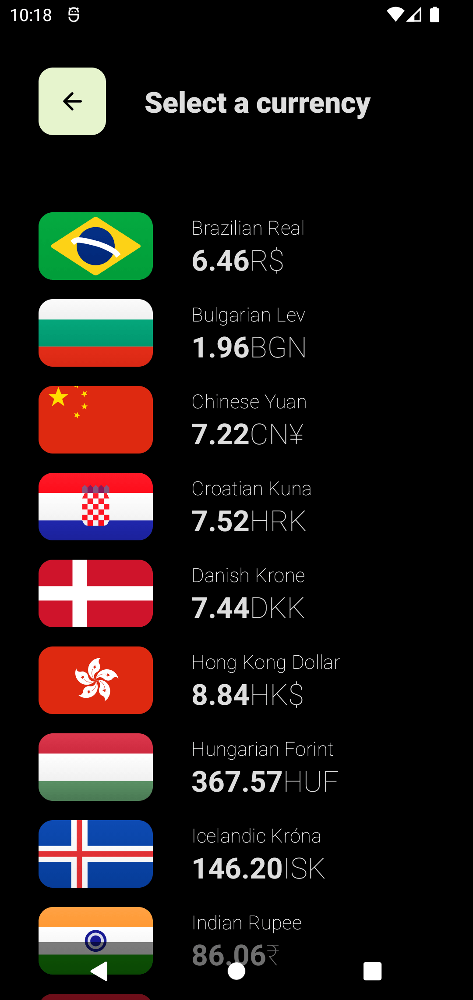
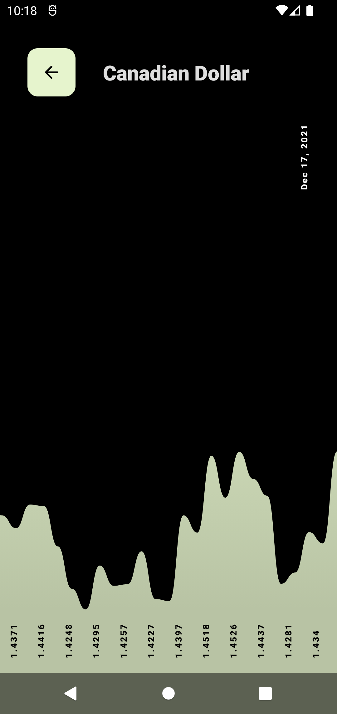

# Currency

Android currency conversion.

 * Currency rates from the [European Central Bank](https://www.ecb.europa.eu/stats/policy_and_exchange_rates/euro_reference_exchange_rates/html/index.en.html)
 * 32 international currencies
 * Currency rates updated every workday
 * All rates downloaded prior to being offline retained for use offline

### Light Mode

    
    

    
    

### Dark Mode

    
    

    
    

## Technical Details

This app is not meant to be "production ready", rather it demonstrates _a better way_ (at least in my opinion) of writing Android apps.
That generally means:

 * No more libraries than is absolutely necessary
 * Code is tested before being written
 * No abuse of View Models as "do-it-all"
 * Separation of view composition from the view itself
    * _allows for the entire UI to be hot-swappable at run-time_

### Libraries Used

 * AndroidX (Jetpack)
    * Compose
    * Compose Navigation
    * Compose Activity
    * Compose ViewModel
    * Startup
    * Room
 * Material
 * Accompanist
    * Insets
 * Truth
 * Mockito Kotlin
 * JUnit

And that's it.

### Architecture

App is divisible into basically 4 layers:

 * Domain
 * Presentation
 * Composition
 * UI

#### UI

The absolutely thinnest layer, where only singular Activity shall be used. Domain and Presentation layers take over the main responsibilities that developers usually entrust to the UI.

Notice that with these changes - _layers being aggressively separated_ - we don't really care whether the Android substrate changes as it's touching only a single class.

#### Composition

Uses thin framework (from a separate module!) to combine, inject and fetch dependencies at composition time. Composition time is understood as a process of assembling the requested feature. Therefore we must assemble dependencies before the view is drawn on the screen and before data is fetched, stored or otherwise manipulated. This is a strict requirement of this design.

It resembles popular framework [Koin](https://insert-koin.io/), but uses inline features rather than whatever Koin is trying to accomplish. Compared to Koin it's trimmed of features which this project does not directly require.

#### Presentation

Divisible components of presentation allow plug-ability of nearly all components and screens. Sudden benefit of this approach is that UI revamps' A/B tests are trivial with the help of [Remote Config](https://firebase.google.com/docs/remote-config/get-started?platform=android) or similar framework / library.

The reuse of components, test-proven conditions and entire features is also trivial and generally plausible.

#### Domain

Encapsulates all the divisible micro-features and tasks app is required to perform. They are as unbiased as possible and abstracted by a guard interface. Abstraction used in this way allows for virtually unlimited extendability, which is in turn widely used in this sample.

---

> _Why would you make something everybody does? Make it better._